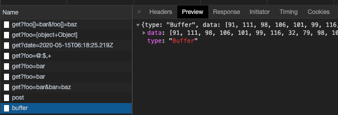
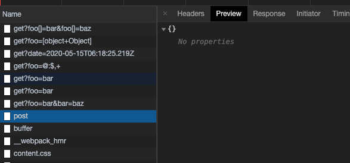

# ts-axios(二) 处理请求body数据

我们在调用XMLHttpRequest实例对象的```send```方法时, 可以传入请求数据 ```body```. 该方法支持多种类型:

- **Document** (in which case it is serialized before being sent.)
- **BodyInit** (which as per the Fetch spec can be a``` Blob```, ```BufferSource```, ```FormData```, ```URLSearchParams```, ```ReadableStream```, or ```USVString``` object.)
- null
- ...

具体的说明, 可以查阅[MDN](https://developer.mozilla.org/en-US/docs/Web/API/XMLHttpRequest/send)

常见的请求方式:

```ts
axios({
  method: 'post',
  url: '/base/post',
  data: { 
    a: 1,
    b: 2 
  }
})
```
这时候, data是一个对象, 我们不能直接将该对象传入send方法, send方法入参不支持object类型, 需要将data转换为JSON字符串.

### transformRequest 函数实现细节

我们需要有一个处理请求参数的工具函数, 用于将data做一下转换.

```ts
// helper/data.ts
import { isPlainObject } from './util';

/**
 * 转换data数据, 对象类型需要转为JSON字符串
 * @param data 需要被转换的data
 */
export function transformRequest (data: any): any {
  if (isPlainObject(data)) {
    return JSON.stringify(data)
  }
  return data
}
```
对于对象类型的判断, 之前使用的isObject函数, 该方法不够严谨, 在数据为```FormData```、```ArrayBuffer```类型时也被判断为对象类型, 因此使用isPlainObject更合理.因此,我们需要对之前url的处理逻辑做相应的调整.

```ts
// helpers/util.js
if (isDate(val)) {
  // 日期类型数据
  val = val.toISOString()
} else if (isPlainObject(val)) {
  // 对象类型
  val = JSON.stringify(val)
}
```

### 处理请求body对data的处理

```ts
// index.ts
import { transformRequest } from './helpers/data'

/**
 * 处理config
 * @param config 请求配置参数
 */
function processConfig(config: AxiosRequestConfig): void {
  const {
    url,
    params
  } = config
  config.url = buildURL(url, params)
  config.data = transformRequest(config)
}
```

### 编写demo

```ts
axios({
  method: 'post',
  url: '/base/post',
  data: {
    a: 1,
    b: 2
  }
})

const arr = new Int32Array([21, 31])

axios({
  method: 'post',
  url: '/base/buffer',
  data: arr
})
```

### 添加server路由

```ts
router.post('/base/post', function(req, res) {
  res.json(req.body)
})

router.post('/base/buffer', function(req, res) {
  let msg = []
  req.on('data', (chunk) => {
    if (chunk) {
      msg.push(chunk)
    }
  })
  req.on('end', () => {
    let buf = Buffer.concat(msg)
    res.json(buf.toJSON())
  })
})
```
> 传递参数为buffer类型的post请求返回结果.



> 传递参数为普通对象的post请求返回结果



可以看出, 这个post请求的返回数据是个空对象, 并不是传参请求时的数据. 这主要是因为目前我们并没有对request header做任何处理, 默认的```Content-Type```为 ```text/plain;charset=UTF-8```. 导致服务端接收请求, 但无法正确的解析这个数据造成的, 在对header的处理中, 来解决这个问题.
