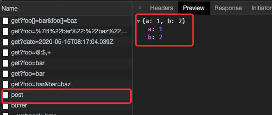

# ts-axios(三) 处理header

上一节, 出现过post请求的JSON字符串数据到服务端解析失败的问题. 我们只需要修改request header中的```Content-Type```字段来解决这个事情.

```ts
axios({
  method: 'post',
  url: '/base/post',
  headers: {
    'content-type': 'application/json;charset=utf-8' // 修改content-type
  },
  data: {
    a: 1,
    b: 2
  }
})
```

### 实现headers的逻辑处理

首先我们需要为```AxiosRequestConfig```类型拓展一个参数```headers```:

```ts
export interface AxiosRequestConfig {
  url: string
  method?: Method
  data?: any
  params?: any,
  headers?: any
}
```

具体的处理headers的逻辑:

```ts
import { isPlainObject } from './util';

/**
 * 统一headers name
 * @param headers 请求headers设置
 * @param normalizedName 需要统一的name参数名
 */
function normalizeHeaderName (headers: any, normalizedName: string): void {
  // 不存在headers参数时, 直接return
  if (!headers) return

  Object.keys(headers).forEach(name => {
    if (name !== normalizedName && name.toUpperCase() === normalizedName.toUpperCase()) {
      headers[normalizedName] = headers[name]
      delete headers[name] // 删掉不规范的属性
    }
  })
}

export function transformHeaders (headers: any, data: any): any {
  // 统一headers中的参数名
  normalizeHeaderName(headers, 'Content-Type')

  if (isPlainObject(data)) {
    if (headers && !headers['Content-Type']) {
      headers['Content-Type'] = 'application/json;charset=utf-8'
    }
  }
  return headers
}
```

然后再修改axios中对config的处理逻辑:

```ts
/**
 * 处理config
 * @param config 请求配置参数
 */
function processConfig(config: AxiosRequestConfig): void {
  const {
    url,
    params,
    headers = {},
    data
  } = config
  config.url = buildURL(url, params)
  // 因为headers中存在对data数据的依赖, 因此需要在转换data之前做headers的处理
  config.headers= transformHeaders(headers, data)
  config.data = transformRequest(data)
}
```

做到这一步了, 发现post请求返回的还是空对象. 其实我们还有一步没有完成, 我们需要改造xhr函数.

```ts
import { AxiosRequestConfig } from '../types/index'

/**
 * @param config 请求参数配置
 */
export default function xhr(config: AxiosRequestConfig) {
  const {
    data = null,
    url,
    method = 'get',
    headers
  } = config

  /** new 一个XMLHttpRequest实例 */
  const request = new XMLHttpRequest()

  /** Initializes a request */
  request.open(method.toUpperCase(), url, true)

  // 添加headers
  Object.keys(headers).forEach(name => {
    if (data === null && name.toLowerCase() === 'content-type') {
      delete headers[name]
    } else {
      request.setRequestHeader(name, headers[name])
    }
  })

  /** Sends the request. If the request is asynchronous (which is the default), this method returns as soon as the request is sent. */
  request.send(data)
}
```

### 编写demo

```ts
axios({
  method: 'post',
  url: '/base/post',
  data: {
    a: 1,
    b: 2
  }
})

axios({
  method: 'post',
  url: '/base/post',
  headers: {
    'content-type': 'application/json;charset=utf-8'
  },
  data: {
    a: 1,
    b: 2
  }
})

const paramsString = 'q=URLUtils.searchParams&topic=api'
const searchParams = new URLSearchParams(paramsString)

axios({
  method: 'post',
  url: '/base/post',
  data: searchParams
})
```


刷新网页查看之前的post请求, 发现所有请求的返回数据都被解析成功了.




从上面的例子与返回结果中, 值得注意的是, 现在普通对象的post请求也可以正常的解析返回结果了.同时,当我们在使用```URLSearchParams```类型的数据作为data时, 浏览器也会自动帮我们加上合适的```Content-Type```(application/x-www-form-urlencoded;charset=UTF-8).