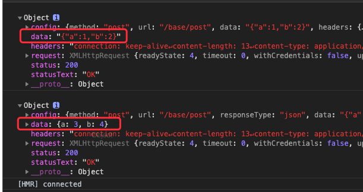

# ts-axios(四) 处理响应数据

通常我们在实际开发过程中, 会在调用axios后处理服务器的响应数据, 并支持```Promise```的链式调用.

```ts
axios({
  method: 'post',
  url: '/base',
  ...
}).then((res) => {
  console.log(res)
})
```

首先, 为response定义好类型. 服务器返回的数据```data```, http状态码 ```status```, 状态消息```statusText```, 响应头```headers```, 请求配置对象```config```, 以及```XMLHttpRequest```对象实例```request```.

```ts
/**
 * axios response
 */
export interface AxiosResponse {
  data: any,
  status: number,
  statusText: string,
  headers: any,
  config: AxiosRequestConfig,
  request: any
}
```
新增axios的返回类型```AxiosPromise```.

```ts
/**
 * axios promise
 */
export interface AxiosPromise extends Promise<AxiosResponse> {}
```

修改```AxiosRequestConfig```, 为其添加```responseType```

```ts
export interface AxiosRequestConfig {
  // ...
  responseType?: XMLHttpRequestResponseType
}
```

```XMLHttpRequestResponseType```, 是内置类型, 它的可选值为```"" | "arraybuffer" | "blob" | "document" | "json" | "text"```

我们需要修改一下axios方法, axios的返回类型为```AxiosPromise```.

```ts
import { AxiosRequestConfig, AxiosPromise } from '../types/index'

/**
 * axios方法
 * @param config 请求参数配置
 */
function axios(config: AxiosRequestConfig): AxiosPromise {
  processConfig(config)
  return xhr(config) // 需要改造xhr方法
}
```

接着我们需要改造一下xhr方法, 使它返回一个```AxiosPromise```类型的数据.

```ts
import {
  AxiosRequestConfig,
  AxiosResponse,
  AxiosPromise
} from '../types/index'

/**
 * @param config 请求参数配置
 */
export default function xhr(config: AxiosRequestConfig): AxiosPromise {
  return new Promise((resolve) => {
    const {
      data = null,
      url,
      method = 'get',
      headers,
      responseType
    } = config
  
    /** new 一个XMLHttpRequest实例 */
    const request = new XMLHttpRequest()

    // 若请求配置中设置了responseType, 则设置
    if (responseType) {
      request.responseType = responseType
    }
  
    /** Initializes a request */
    request.open(method.toUpperCase(), url, true)
  
    /**
     * 定义监听readyState状态值的回调函数
     * 0	UNSENT	Client has been created. open() not called yet.
     * 1	OPENED	open() has been called.
     * 2	HEADERS_RECEIVED	send() has been called, and headers and status are available.
     * 3	LOADING	Downloading; responseText holds partial data.
     * 4	DONE	The operation is complete.
     **/
    request.onreadystatechange = function handleLoad() {
      const { readyState } = request
      if (readyState !== 4) return
      
      // readyState 为4时, 数据请求完毕
      const responseHeaders = request.getAllResponseHeaders()
      const responseData = responseType && responseType !== 'text'
        ? request.response
        : request.responseText
      const response: AxiosResponse = {
        data: responseData,
        status: request.status,
        statusText: request.statusText,
        headers: responseHeaders,
        config,
        request
      }
      resolve(response)
    }
    
    // 添加headers
    Object.keys(headers).forEach(name => {
      if (data === null && name.toLowerCase() === 'content-type') {
        delete headers[name]
      } else {
        request.setRequestHeader(name, headers[name])
      }
    })
  
    /** Sends the request. If the request is asynchronous (which is the default), this method returns as soon as the request is sent. */
    request.send(data)
  })
}
```

### 编写代码

```ts
axios({
  method: 'post',
  url: '/base/post',
  data: {
    a: 1,
    b: 2
  }
}).then((res) => {
  console.log(res)
})

axios({
  method: 'post',
  url: '/base/post',
  responseType: 'json', // 期望返回值的类型为json类型
  data: {
    a: 3,
    b: 4
  }
}).then((res) => {
  console.log(res)
})
```
> 可以看到控制台打印出来的数据, 第一个回调打印的返回数据```data```是json字符串, 第二个例子, 指定了```responseType```, 因此```data```被转义为json数据.

