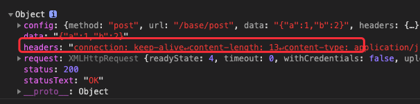
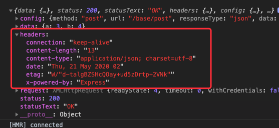

# ts-axios(五) 处理响应headers数据

通过```request.getAllResponseHeaders()```方法获取到的headers是一段字符串:



因此,我们需要对这段字符串转换一下. 期待获得一个对象结构数据.

```json
{
  connection: keep-alive
  content-length: 13
  content-type: application/json; charset=utf-8
  date: Mon, 18 May 2020 09:02:29 GMT
  etag: W/"d-Ssxx4FRxEutDLwo2+xkkxKc4y0k"
  x-powered-by: Express
}
```

### parseHeaders工具函数的实现

```ts
// helpers/headers.ts
/**
 * 转换 headers 字符串为对象结构
 * @param headers request.getAllResponseHeaders()
 */
export function parseHeaders(headers: string): any {
  let parsedObj = Object.create(null) // 创建一个完全空的对象

  if (!headers) return parsedObj

  headers.split('\r\n').forEach(pair => {
    let [key, val] = pair.split(':')
    key = key.trim().toLowerCase()
    if (!key) {
      return
    }
    if (val) {
      val = val.trim()
    }
    parsedObj[key] = val
  })
  return parsedObj
}
```

我们在 xhr.ts 中对request.getAllResponseHeaders()赋值的变量使用```parseHeaders```:

```ts
// xhr.ts
import { parseHeaders } from './helpers/headers'

...

request.onreadystatechange = function handleLoad () {
  const { readyState } = request
  if (readyState !== 4) return
  
  // 转化 headers 字符串
  const responseHeaders = parseHeaders(request.getAllResponseHeaders())

  const responseData = responseType && responseType !== 'text'
    ? request.response
    : request.responseText
  const response: AxiosResponse = {
    data: responseData,
    status: request.status,
    statusText: request.statusText,
    headers: responseHeaders,
    config,
    request
  }
  resolve(response)
}
```

再看看控制台打印出的响应数据的 headers, 已经可以正常工作：

