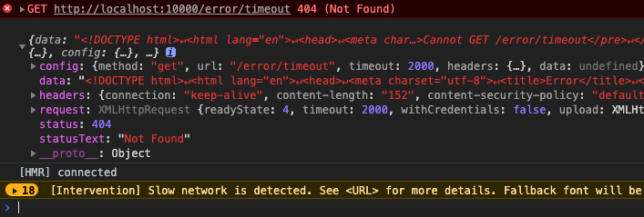

# ts-axios(七) 处理数据异常情况

```ts
axios({
  method: 'get',
  url: '/error/get'
}).then((res) => {
  console.log(res)
}).catch(error) {
  console.log(error)
}
```

通常我们会使用.catch 回调来捕捉请求数据过程中发生的错误. 因此我们还需要对 axios 添加对请求发生错误的情况做一些处理.

一般情况下,我们会把请求错误分为以下情况来处理.

### 处理网络错误

比如网络出现来异常, 或者网络不通会触发 `XMLHttpRequest`对象实例的`error`事件. 我们可以在`xhr`函数中来监听.

```ts
request.onerror = function handleError() {
  reject(new Error("Network Error."));
};
```

### 处理超时错误

我们可以发送请求时为请求配置超时时间, 当请求超过设定的超时时间时,就会自动终止请求, 并且触发`timeout`事件.

首先需要为请求配置类型添加一个 timeout 参数.

```ts
// ...
timeout?: number
```

接下来在`xhr`函数中, 针对 timeout 做处理.

```ts
const {
  /** */
  timeout,
} = config;

/** new 一个XMLHttpRequest实例 */
const request = new XMLHttpRequest();

if (timeout) {
  request.timeout = timeout;
}

/** 设置超时时间 */
if (timeout) {
  request.timeout = timeout;
}

// 错误处理
request.ontimeout = function handleError() {
  reject(new Error(`Timeout of ${timeout}ms exceeded.`));
};
```

### 处理非 200 状态码

关于 http 状态码, 顺便一提, MDN 上大概分为 5 个类型:

- Informational responses (100–199),
- Successful responses (200–299),
- Redirects (300–399),
- Client errors (400–499),
- and Server errors (500–599).

我们针对 http 状态码非 200 的请求做一下处理.

```ts
/**
 * 处理响应数据状态码
 **/
function handleResponse(response: AxiosResponse) {
  const { status } = response;
  if (status >= 200 && status < 300) {
    // 正常返回
    resolve(response);
  } else {
    reject(new Error(`Request failed with status code ${status}`));
  }
}

// 状态变化
request.onreadystatechange = function handleLoad() {
  const { readyState } = request;
  if (readyState !== 4) return;

  if (request.status === 0) return;

  const responseHeaders = request.getAllResponseHeaders();
  const responseData =
    responseType && responseType !== "text"
      ? request.response
      : request.responseText;
  const response: AxiosResponse = {
    data: responseData,
    status: request.status,
    statusText: request.statusText,
    headers: parseHeaders(responseHeaders),
    config,
    request,
  };
  // 处理结果
  handleResponse(response); // ⬅️⬅️
};
```

### 增强错误处理

以上的各类错误处理, 仅仅只给出了错误的文本信息, 这样程序处理拿到的信息就十分有限, 我们可以尝试增强一下错误信息. 我们先创建一个 AxsiosError 类.

```ts
// types/index.ts
export interface AxiosError {
  config: AxiosRequestConfig;
  code?: string;
  request?: any;
  response?: AxiosResponse;
  isAxiosError: boolean;
}
```

接下来, 我们需要创建`error.ts`, 实现`AxiosError`类, 它继承于`Error`类.

```ts
import { AxiosRequestConfig, AxiosResponse } from "../../types/index";

export class AxiosError extends Error {
  isAxiosError: boolean;
  config: AxiosRequestConfig;
  code?: string | null;
  request?: any;
  response?: AxiosResponse;

  constructor(
    message: string,
    config: AxiosRequestConfig,
    code?: string | null,
    request?: any,
    response?: AxiosResponse
  ) {
    super(message);

    this.config = config;
    this.code = code;
    this.request = request;
    this.response = response;
    this.isAxiosError = true;

    // 解决 TypeScript 继承一些内置对象的时候的坑
    Object.setPrototypeOf(this, AxiosError.prototype);
  }
}

/**
 * 创建错误
 * @param message 提示内容
 * @param config 请求配置
 * @param code http状态code
 * @param request 请求对象
 * @param response 响应对象
 */
export function createError(
  message: string,
  config: AxiosRequestConfig,
  code?: string | null,
  request?: any,
  response?: AxiosResponse
): AxiosError {
  const error = new AxiosError(message, config, code, request, response);
  return error;
}
```

接下来, 我们需要利用`createError`方法来增强`xhr.ts`中对错误内容的处理.

```ts
import { createError } from "./helpers/error";

// 超时处理
request.ontimeout = function handleError() {
  reject(
    createError(
      `Timeout of ${timeout}ms exceeded.`,
      config,
      "ECONNABORTED",
      request
    )
  );
};

// 错误处理
request.onerror = function handleError() {
  reject(createError("Network Error.", config, null, request));
};

function handleResponse(response: AxiosResponse) {
  const { status } = response;
  if (status >= 200 && status < 300) {
    // 正常返回
    resolve(response);
  } else {
    reject(
      createError(
        `Request failed with status code ${status}`,
        config,
        null,
        request,
        response
      )
    );
  }
}
```

为了方便应用程序访问 axios 库里的一些类型`types`, 我们需要将库和类型说明导出. 我们创建一个`axios.ts`文件, 将原来`index.ts`中的内容复制过去. 在`index.ts`中输出以下内容:

```ts
import axios from "./axios";

export * from "../types"; // 导出所有types说明, 以便外部应用访问

export default axios; // 默认导出axios库
```

### 编写 demo

```ts
import axios, { AxiosError } from "../../src/index";

axios({
  method: "get",
  url: "/error/timeout",
  timeout: 2000,
})
  .then((res) => {
    console.log(res);
  })
  .catch((e: AxiosError) => {
    // 使用AxiosError类型说明
    console.log(e.response);
  });
```

这样捕获到的错误将得到增强, 包括 code、message、request、response 等字段.


