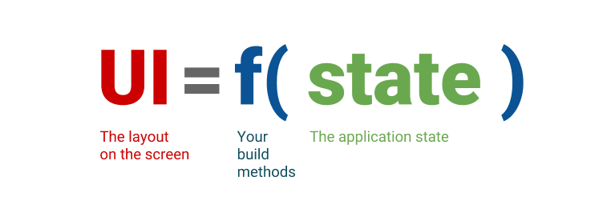
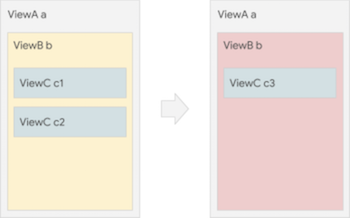

# 什么是声明式UI

声明式UI和响应式UI是对应的概念。在flutter框架中，采用的则是声明式UI。一切UI都是关于状态值的函数。



查看官方的hello world感受一下声明式UI的用法：

```js
import 'package:flutter/material.dart';

void main() => runApp(new MyApp());

class MyApp extends StatelessWidget {
  @override
  Widget build(BuildContext context) {
    return new MaterialApp(
      title: 'Welcome to Flutter',
      home: new Scaffold(
        appBar: new AppBar(
          title: new Text('Welcome to Flutter'),
        ),
        body: new Center(
          child: new Text('Hello World'),
        ),
      ),
    );
  }
}
```

再看一下这个简单的例子：



为了实现图片右侧的效果，我们通常需要获得ViewB b的实例，然后再改变颜色、将容器内部的元素移出，再创建并添加ViewC c3:

```js
b.setColor(red) // 改变颜色
b.clearChildren() // 清空容器
ViewC c3 = new ViewC(...) // 创建ViewC c3
b.add(c3) // 添加
```

在声明式UI中，视图配置（例如flutter中的widget）是不可变的，并且只是轻量级的。如果需要改变UI，widget会在自身触发重建并构造一个新的widget子树（最常见的是通过flutter中的StatefulWidgets上调用setState()）。

```js
return ViewB(
  color: red,
  child: ViewC(...),
)
```

在代码中可以体会到，在需要修改UI时，fuller会**创建新的实例，而不是改变旧的实例**。fuller框架在采用的```RenderObjects```来管理传统的UI对象，```RenderObjects```在帧之间保持不变，flutter的轻量级widget告诉框架在状态之间改变```RenderObjects```，然后flutter框架会处理剩余的工作。

### 参考资料

- [文档讲解 - 什么是声明式UI](https://www.jianshu.com/p/8d8555dc7569)
- [flutter入门：线程、异步、声明式UI](https://segmentfault.com/a/1190000020379325?utm_source=tag-newest)